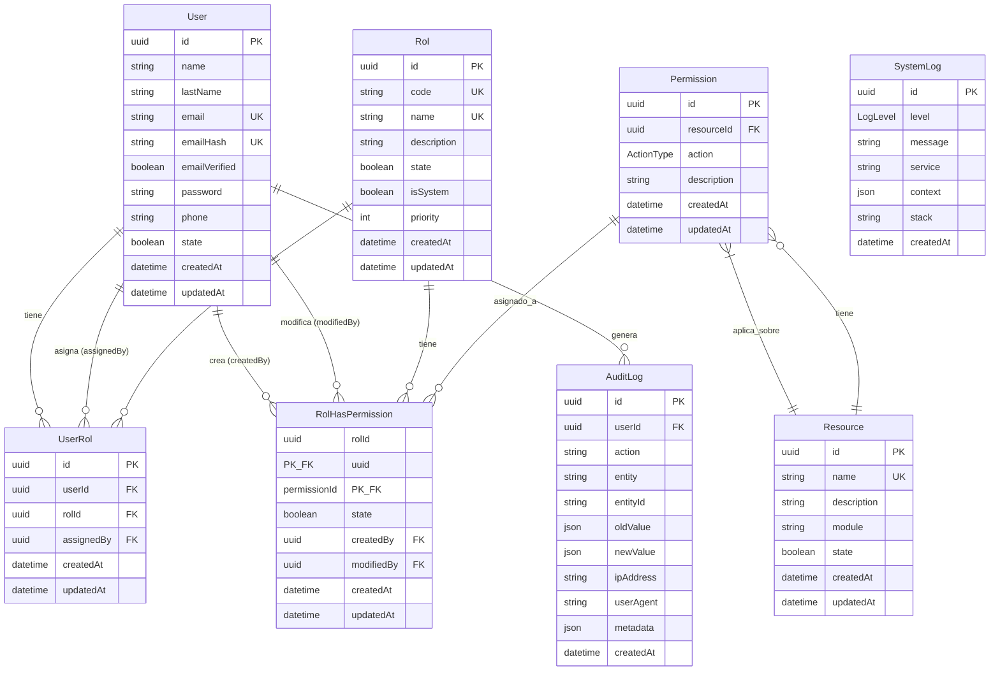

# Diagrama de Entidad-Relación (DER) - Sistema RBAC

## 📊 Diagrama Visual



---

## 🔗 Relaciones Principales

### **1. User ↔ Rol (Many-to-Many)**

```
User ←→ UserRol ←→ Rol
```

- Un usuario puede tener múltiples roles
- Un rol puede ser asignado a múltiples usuarios
- `UserRol` es la tabla pivote con auditoría (assignedBy)

### **2. Rol ↔ Permission (Many-to-Many)**

```
Rol ←→ RolHasPermission ←→ Permission
```

- Un rol tiene múltiples permisos
- Un permiso puede estar en múltiples roles
- `RolHasPermission` tiene auditoría completa (createdBy, modifiedBy)

### **3. Resource ↔ Permission (One-to-Many)**

```
Resource ←→ Permission (con ActionType enum)
```

- Un recurso tiene múltiples permisos (una por cada acción)
- Cada permiso combina: Resource + ActionType
- Constraint único: `[resourceId, action]`

### **4. Auditoría**

```
User → AuditLog (acciones de usuarios)
SystemLog (logs de aplicación, sin FK)
```

---

## 📋 Enums

### **ActionType** (Acciones CRUD extendidas)

```
CREATE   → Crear nuevos registros
READ     → Ver/Leer registros individuales
UPDATE   → Modificar registros existentes
DELETE   → Eliminar registros
LIST     → Listar/Buscar registros
EXPORT   → Exportar datos
IMPORT   → Importar datos masivos
APPROVE  → Aprobar (workflows)
REJECT   → Rechazar (workflows)
MANAGE   → Gestión completa del recurso
```

### **LogLevel** (Niveles de severidad)

```
INFO     → Información general
WARN     → Advertencias
ERROR    → Errores recuperables
CRITICAL → Errores críticos del sistema
```

---

## 🔑 Índices Implementados

### User

- `email` (búsquedas frecuentes)
- `emailHash` (verificación)
- `state` (filtrado activos/inactivos)

### Rol

- `code` (identificación única)
- `state` (filtrado)
- `isSystem` (proteger roles del sistema)

### UserRol

- `userId` (lookup por usuario)
- `rolId` (lookup por rol)
- `assignedBy` (auditoría)

### Permission

- `resourceId` (filtrado por recurso)
- `action` (filtrado por acción - enum)

### RolHasPermission

- `rolId` (verificación de permisos)
- `permissionId` (lookup)
- `state` (permisos activos)
- `createdBy` (auditoría)

### Resource

- `name` (búsqueda por nombre)
- `module` (agrupación)
- `state` (filtrado)

### AuditLog

- `userId` (historial por usuario)
- `action` (filtrado por tipo de acción)
- `entity` (filtrado por entidad)
- `entityId` (historial de registro específico)
- `createdAt` (búsquedas temporales)

### SystemLog

- `level` (filtrado por severidad)
- `service` (filtrado por servicio)
- `createdAt` (búsquedas temporales)

---

## 🛡️ Constraints e Integridad

### Unique Constraints

- `User.email`
- `User.emailHash`
- `Rol.code`
- `Rol.name`
- `Resource.name`
- `UserRol[userId, rolId]` → Un usuario no puede tener el mismo rol dos veces
- `Permission[resourceId, action]` → No duplicar permisos

### Cascade Deletes

- `User` → `UserRol` (CASCADE)
- `Rol` → `UserRol` (CASCADE)
- `Rol` → `RolHasPermission` (CASCADE)
- `Permission` → `RolHasPermission` (CASCADE)
- `Resource` → `Permission` (CASCADE)

### Set Null (Preservar auditoría)

- `UserRol.assignedBy` (SETNULL)
- `RolHasPermission.createdBy` (SETNULL)
- `RolHasPermission.modifiedBy` (SETNULL)
- `AuditLog.userId` (SETNULL)

---

## 💡 Ejemplos de Uso

### Crear un permiso

```typescript
// Permiso: users:read
Permission {
  resourceId: "uuid-resource-users",
  action: ActionType.READ,
  description: "Ver información de usuarios"
}
```

### Asignar rol a usuario

```typescript
UserRol {
  userId: "uuid-user",
  rolId: "uuid-rol-admin",
  assignedBy: "uuid-admin-who-assigned"
}
```

### Verificar permiso

```typescript
// ¿El usuario tiene permiso users:read?
1. Obtener roles del usuario (UserRol)
2. Obtener permisos de esos roles (RolHasPermission)
3. Verificar si existe Permission con resourceId="users" y action="READ"
```

### Registrar acción en auditoría

```typescript
AuditLog {
  userId: "uuid-user",
  action: "USER_UPDATED",
  entity: "User",
  entityId: "uuid-target-user",
  oldValue: { name: "John" },
  newValue: { name: "Johnny" },
  ipAddress: "192.168.1.1"
}
```

---

## 🎯 Ventajas de este Diseño

1. **Escalable**: Índices optimizados para millones de registros
2. **Auditable**: Tracking completo de quién hizo qué y cuándo
3. **Flexible**: ActionType enum cubre 95% de casos
4. **Type-safe**: Enums en PostgreSQL + TypeScript
5. **Mantenible**: Estructura clara y documentada
6. **Performance**: Sin JOINs innecesarios (Action como enum)
7. **Integridad**: Constraints y cascades bien definidos

---

## 📚 Queries Comunes

### Obtener permisos de un usuario

```prisma
// Prisma query
const userPermissions = await prisma.user.findUnique({
  where: { id: userId },
  include: {
    roles: {
      include: {
        rol: {
          include: {
            permisos: {
              where: { state: true },
              include: {
                permission: {
                  include: { resource: true }
                }
              }
            }
          }
        }
      }
    }
  }
});
```

### Verificar si usuario tiene permiso específico

```sql
-- SQL directo
SELECT EXISTS(
  SELECT 1
  FROM "UserRol" ur
  JOIN "RolHasPermission" rhp ON rhp."rolId" = ur."rolId"
  JOIN "Permission" p ON p.id = rhp."permissionId"
  JOIN "Resource" r ON r.id = p."resourceId"
  WHERE ur."userId" = $1
    AND r.name = $2
    AND p.action = $3
    AND rhp.state = true
    AND ur."rolId" IN (SELECT id FROM "Rol" WHERE state = true)
) AS has_permission;
```

### Auditoría: Últimas acciones de un usuario

```prisma
const recentActions = await prisma.auditLog.findMany({
  where: { userId },
  orderBy: { createdAt: 'desc' },
  take: 20,
  include: { user: true }
});
```
